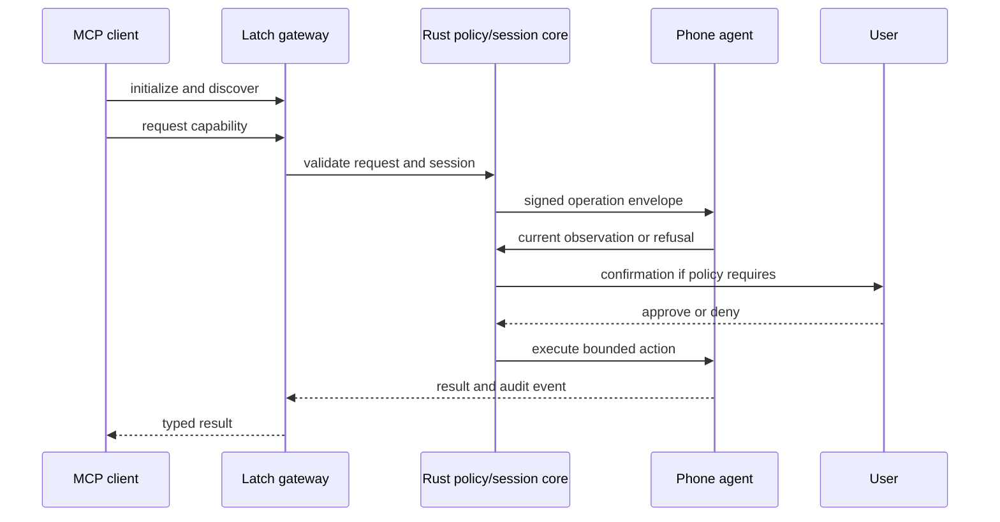

<!-- Mirrored from the MobileMCP Notion handbook. Source page: https://app.notion.com/p/3ec9b3674a8a8169a2eac46fd6d992d6?pvs=204 -->
## Architectural decision
Use a portable Rust core for protocol, policy, session, crypto, fixtures, and MCP server behavior. Keep Android and iOS UI, permissions, lifecycle, and platform APIs native. Use TypeScript only for optional adapters, setup surfaces, or edge glue where it materially improves integration.
This is not a microservice architecture. It is a small number of explicit boundaries inside one open-source repository.
## Runtime planes
### Device plane
Runs on the phone. It owns:
- platform permission state;
- observation providers;
- action executors;
- foreground/background lifecycle;
- local pairing;
- device key material;
- visible status and stop controls;
- local audit buffer.
The device plane must remain safe when the gateway is unavailable.
### Core plane
The Rust library owns:
- versioned protocol types;
- capability registry;
- policy evaluation;
- session state machine;
- request correlation;
- cancellation;
- idempotency;
- redacted event model;
- cryptographic envelopes;
- deterministic fixtures.
The core must not know about Compose, SwiftUI, Android contexts, iOS view controllers, or vendor-specific MCP behavior.
### Gateway plane
The gateway owns:
- MCP initialization and negotiation;
- tool, resource, and prompt exposure where supported;
- device registry;
- authenticated device channels;
- routing and backpressure;
- policy decision forwarding;
- lifecycle of remote sessions;
- logs and health endpoints.
The gateway must not become a general-purpose remote shell.
### Adapter plane
Adapters translate external agent formats into the core contract. The MCP adapter is first-class. Future adapters must call the same policy and session APIs; they may not bypass them.
## Target repository shape
```javascript
latch/
  apps/android/                 Kotlin, Compose, native services
  apps/ios/                     Swift, SwiftUI, App Intents
  crates/protocol/              wire types and version negotiation
  crates/policy/                capability and risk decisions
  crates/session/               lifecycle, cancellation, idempotency
  crates/crypto/                pairing, signatures, key rotation
  crates/fixtures/              shared deterministic scenarios
  crates/test-harness/          protocol-level test utilities
  servers/mcp/                  Rust MCP adapter and gateway
  packages/schemas/             JSON Schema and generated fixtures
  packages/generated/           checked-in narrow bindings if needed
  adapters/typescript/          optional setup and compatibility adapters
  docs/handbook/                user and contributor documentation
  docs/protocol/                normative protocol documentation
  docs/platform/                Android/iOS notes
  docs/adr/                     architecture decisions
  docs/runbooks/                operations and incident playbooks
  tests/contract/               cross-language contract tests
  tests/integration/            device/gateway tests
  tests/evals/                  task and safety evaluations
  tests/fixtures/               screenshots, trees, and traces
  .github/                      CI, issue forms, release workflows
```
## Data flow

The user confirmation path is part of the protocol state machine. It is not a best-effort UI toast.
## Transport strategy
- **Local process:** stdio for a local MCP server where the client supports it.
- **Remote MCP:** Streamable HTTP with authentication and request correlation.
- **Device channel:** an authenticated, reconnecting, bounded channel; the implementation may use WebSocket or another transport, but it must not be confused with MCP transport.
- **State:** local storage on the device; explicit gateway state; no implicit global memory in request handlers.
- **Network ownership:** local network and user-hosted deployment are first-class. A stateful edge host may be documented as an optional deployment, not a mandatory service.
Avoid legacy SSE assumptions. Revalidate the MCP specification and SDK behavior before each release.
## State machines
### Session
created → pairing → ready → active → awaiting_confirmation → paused → revoked → closed
Transitions must be explicit, logged, and idempotent. Closing or revoking invalidates pending commands.
### Command
received → validated → policy_checked → queued → sent → observed → executing → succeeded \| refused \| failed \| cancelled \| expired
A command has a unique id, a session id, a capability, a target snapshot, a policy decision, a deadline, and a cancellation token.
## Versioning
- Protocol versions use explicit major/minor semantics.
- Additive fields are tolerated; removed or reinterpreted fields require a major version.
- Every request and result includes a protocol version and capability version.
- Shared JSON Schema and golden fixtures are checked into the repository.
- Clients negotiate the highest mutually supported version and receive a readable downgrade explanation.
## Failure design
Every network or platform failure must map to one of:
- retryable transport failure;
- stale observation;
- unsupported capability;
- missing permission;
- policy refusal;
- user denial;
- expired confirmation;
- cancelled operation;
- device unavailable;
- internal defect.
The error carries a safe message, stable code, recovery hint, and correlation id. It must never include tokens, raw screen contents, or personal data.
## Scalability boundary
The first deployment is a single gateway process with bounded memory and an explicit device registry. Scale only when measurement shows a need.
If a multi-user deployment is later added, isolate:
- tenant and device identities;
- key material;
- rate limits;
- audit partitions;
- stateful session ownership;
- storage encryption and deletion.
Do not introduce queues, databases, or service meshes before a measured bottleneck and a migration plan exist.
